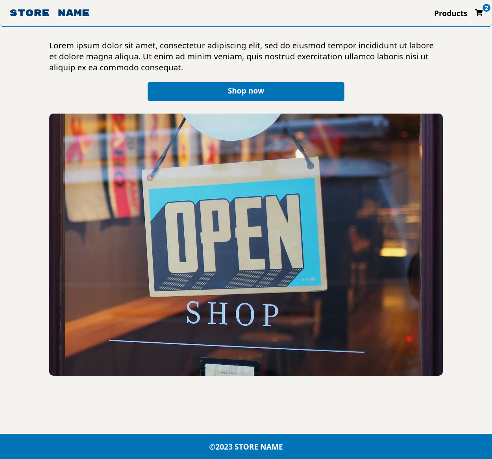
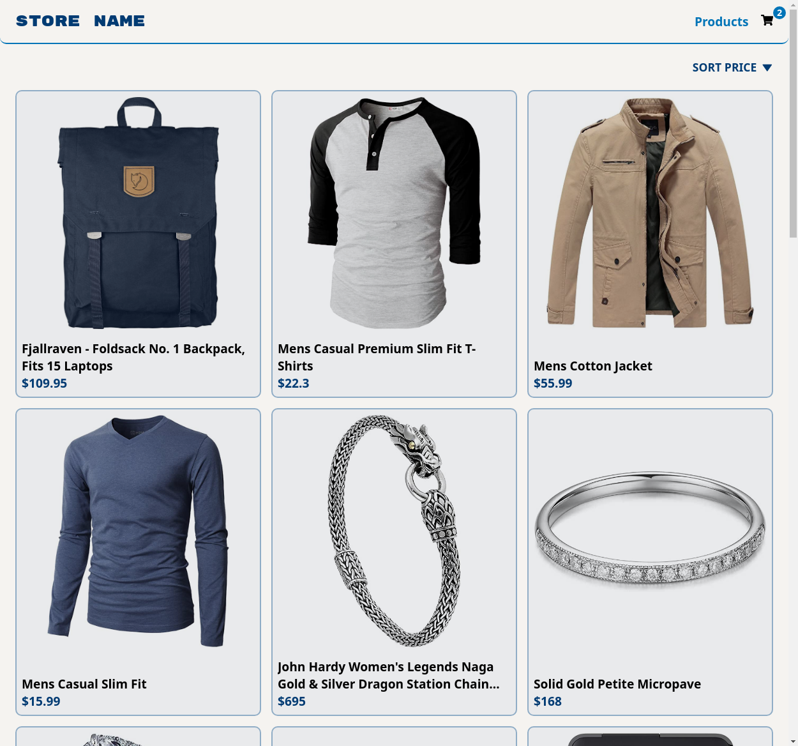
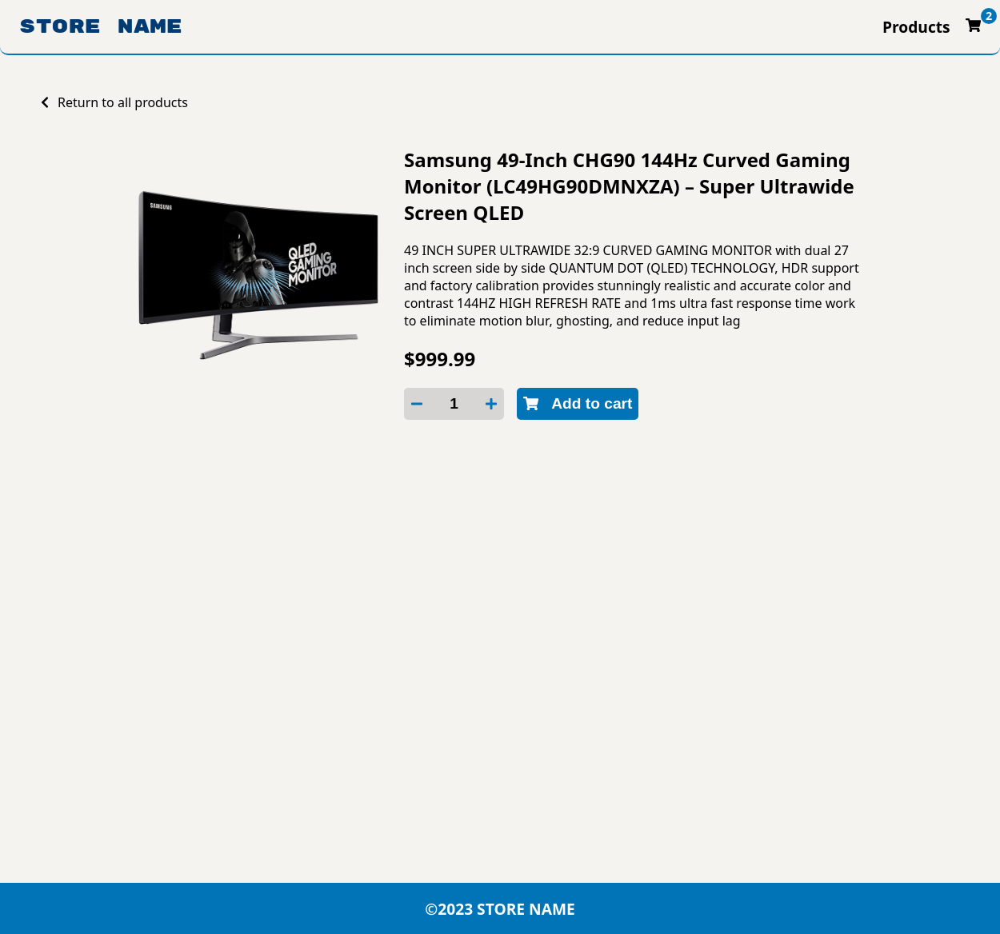
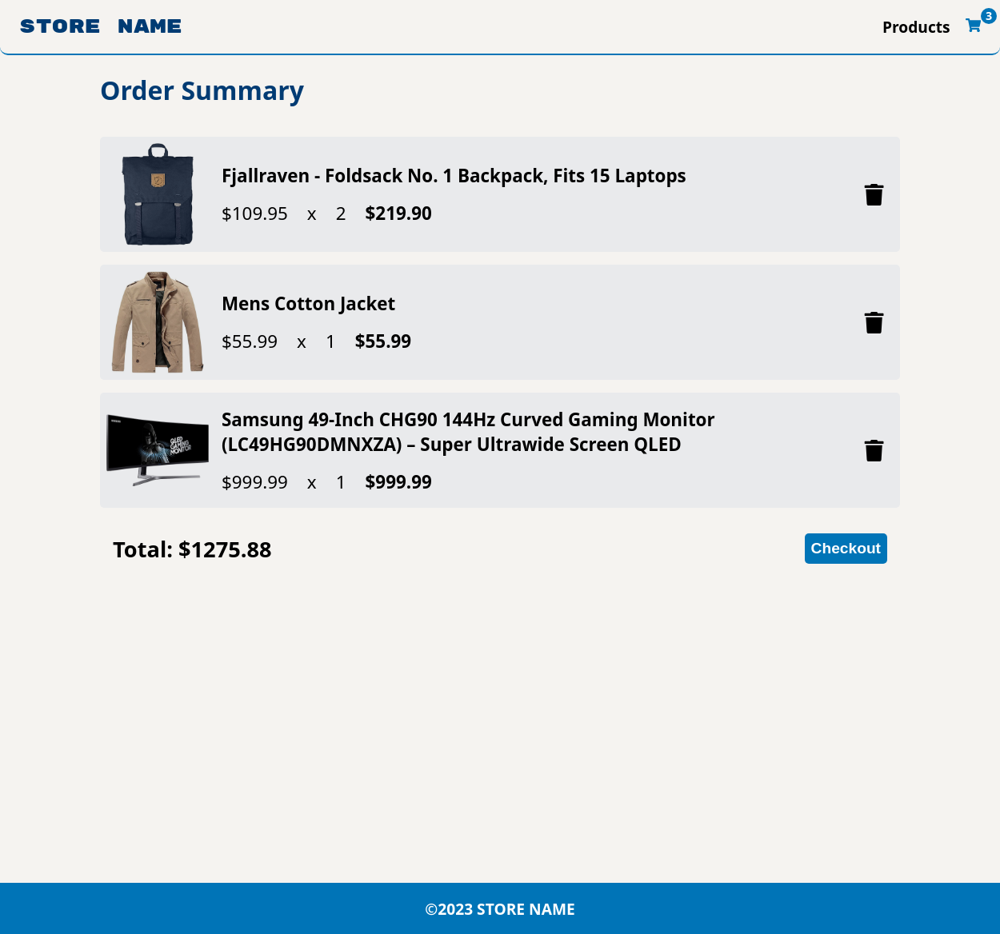
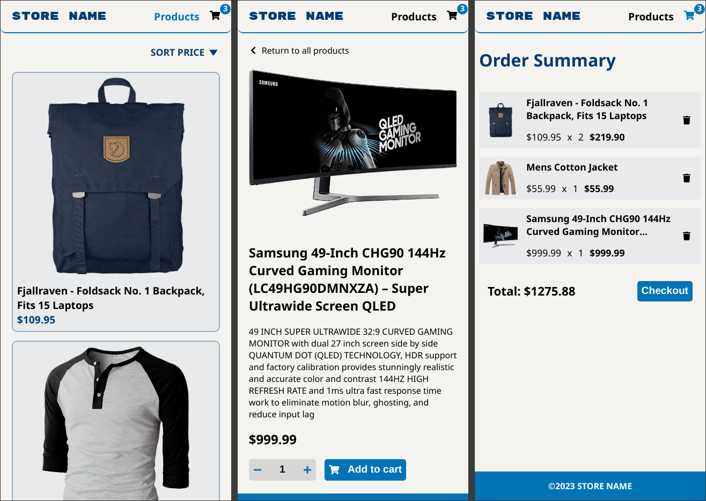

# The Odin Project #20: Shopping Cart

The goal of this Odin Project assignment was to create a store website with the home, store and cart pages.

I started and finished this project in July 2023.

## Assignment

[The Odin Project - React - #20 Shopping Cart](https://www.theodinproject.com/lessons/node-path-react-new-shopping-cart)

## Technology

- React
- React Router v6
- JavaScript
- CSS
- Vite

## Key Concepts

- Multi-page and single-page apps
- Client-side routing
- BrowserRouter & Routes: createBrowserRouter(), createRoutesFromElements() & RouterProvider
- Route, path & element
- Link & NavLink: navigation, active styling, state & useLocation()
- Route Params: useParams()
- useEffect: fetching data from the API
- Context: useContext, createContext, context provider, passing values
- useSearchParams()
- loader & useLoaderData()
- Error handling: errorElement, useRouteError & 404 page

## Features

- Store items come from [FakeStore API](https://github.com/keikaavousi/fake-store-api)
- The user can navigate between the pages with a navigation bar.
- The shopping cart icon in the navigation bar displays the number of items currently in the cart.
- The user can manually type in how many items they want to buy or use the increment / decrement buttons.

## Links

[Live Demo](https://brightneon7631.github.io/odin-shopping-cart/)

[My Other Projects](https://brightneon7631.github.io/odin-scrimba-projects/)

## Screenshots

### Desktop









### Mobile



## Sources

- https://unsplash.com/photos/c9FQyqIECds by Mike Petrucci
- https://fonts.google.com/specimen/Rubik+Mono+One

## Deployment

```bash
# clone repo
git clone

# install project dependencies
npm install

# run vite dev server
npm run dev

# create a production build
npm run build
```